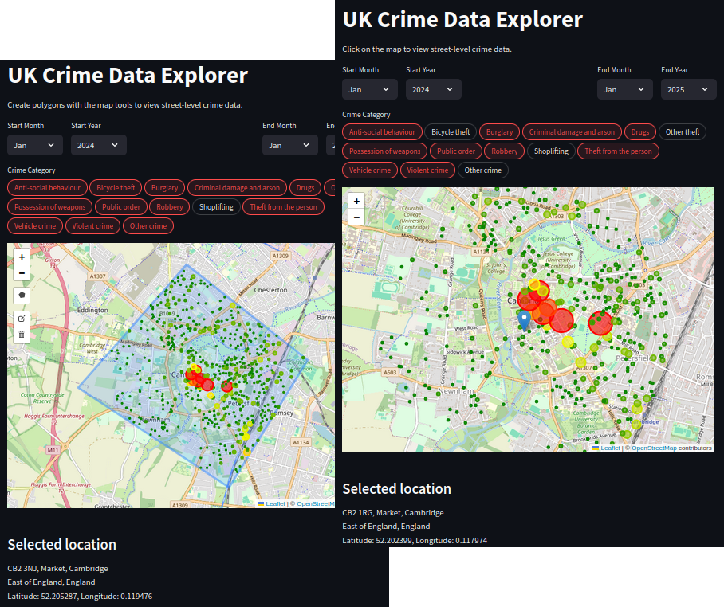

# UK Crime Maps

**A free and open-source project designed to visualise and analyse geospatial crime data from across the UK.**

This project uses interactive crime maps to present publicly available data on crime and policing in England, Wales, and Northern Ireland. Additionally, it provides valuable insights through intuitive visualisations and analyses.

---

## Installing and Deploying

For installation and deployment details please refer to [INSTALL.md](INSTALL.md).

---

## Features

### Types of maps

The app offers three crime maps:

+ Clickable Crime Map:
    + You can click on the map to view street-level crime data near the area with filters by date or type of crime.
+ Postcode Crime Map:
    + You can enter a postcode to view street-level crime data near that postcode with filters by date or type of crime.
+ Area Crime Map
    + You can create an area on the map to view street-level crime data in that area with filters by date or type of crime.

### Other features

The **UK Crime Data Explorer** leverages [Streamlit](https://streamlit.io/) as its back-end framework to build the web app. You can deploy the application easily using the free [Streamlit Community Cloud](https://share.streamlit.io/), host it on your own server, or use [Snowflake](https://www.snowflake.com/en/uk/) for enhanced scalability and performance.

## Upcoming features (To dos)

+ Check viability of using ThreadPoolExecutor to request several dates at the same time (errors might be caused by the API call limits).

+ Show the radius for crimes in map_click.

+ Add a way to show crimes per location and not a radius around the click in map_click.
    + Show the location boundary.

+ Move crime category and selected location to below the map.

+ Accept enter as button click in the postcode map.

+ Add project to my website as an embedding.

+ Play around with st.set_page_config() to costumise the app more (e.g. changing layout to wide -- layout="wide").
    + Ensure that st.columns behave well and improve the default widths etc.

+ Add proper comments/documentation to all functions.

+ Add installation steps in INSTALL.md.

+ Add a compare feature to compare to different postcodes.

+ Consider creating a database / reading from a static file instead of using the API for faster results.

--- 

## License

The web app is available as open source under the terms of the [GPL-3.0 license](LICENSE).